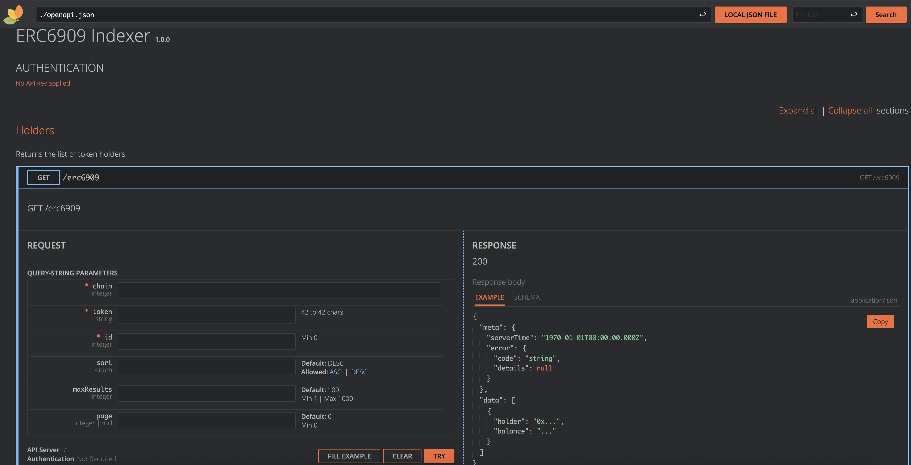

# ERC6909 Indexer

Lightweight and efficient indexer of ERC6909 token holders compliant with the OpenAPI specification.

## Design

The indexer has been design in a way to reduce resource usage.
It stores the balances of the token holders in a NoSQL database and updates them just-in-time.
This means that tokens get indexed only when they are requested and that some RPC calls may be needed before returning the results.

Benefits:

-   Low resource usage
-   Store only the data needed
-   Totally idle between requests

Drawbacks:

-   Response can take time, especially if the token is not indexed yet
-   Probably not adapted for large volumes of data

### Intended use

Third-party services offer this type of endpoints fo ERC20 tokens, but not yet for ERC6909.
This indexer allows to run an indexer for these tokens.
It is not optimized for speed and high throughput, but it is light and efficient.
Therefore, it is designed for internal or restricted use rather than exposed to the public.

### Behavior choices

-   Auto-disovery of the token contract addresses at the first request.
-   Event indexing only triggered on page 0 to keep consistency as much as possible between consecutive requests of the same flow.

### Limitations

While it should work with most ERC6909 tokens, special tokens with specific features like rebasing, or who implement `Mint` and `Burn` events on top of the `Transfer` event may create inconsistent results. Here we consider that all balance changes emit a `Transfer` event.

## Installation

```bash
git pull https://github.com/0xwetzo/ERC6909-Indexer.git
cd ERC6909-Indexer
npm install
```

## Configuration

The indexer is configured in the `config.ts` file.
Here you can add/remove support for more chains by following the 4 indicated steps.
Also add the RPC url for this chain in the `.env` file.

## Usage

Run the indexer with:

```bash
npx tsx src
```

Get the results at http://127.0.0.1:6909/api.html or calling the endpoint at http://127.0.0.1:6909/erc6909:

```bash
curl -X GET "http://127.0.0.1:6909/erc6909?chain=31337&token=0x5FbDB2315678afecb367f032d93F642f64180aa3&id=1&sort=DESC" -H 'accept: application/json' | jq
```

Output:

```bash
  % Total    % Received % Xferd  Average Speed   Time    Time     Time  Current
                                 Dload  Upload   Total   Spent    Left  Speed
100   285  100   285    0     0   7740      0 --:--:-- --:--:-- --:--:--  7916
{
  "meta": {
    "serverTime": "2025-04-12T18:12:21.795Z"
  },
  "data": [
    {
      "holder": "0x3C44CdDdB6a900fa2b585dd299e03d12FA4293BC",
      "balance": "1000999"
    },
    {
      "holder": "0x70997970C51812dc3A010C7d01b50e0d17dc79C8",
      "balance": "999000"
    },
    {
      "holder": "0xf39Fd6e51aad88F6F4ce6aB8827279cffFb92266",
      "balance": "123456"
    }
  ]
}
```

## Prerequisites

You'll need access to an archive node from any RPC provider and an API key for Etherscan.
The free tier should be sufficient for most personnal projects use cases.

## OpenAPI Specification

The indexer exposes an OpenAPI specification at `/openapi.json`.
A RapiDoc interface is available at `/api.html`.

## Queries

The indexer supports the following queries:

-   `/erc6909`: Returns a sorted and paginated list of ERC6909 token holders.

Use the OpenAPI specification or the RapiDoc interface to get more details on the input and output.



## Manual testing

A `justfile` and a Foundry project with a Mock ERC6909 contract are provided with the useful commands to create various scenarios for manual testing.
Find an example scenario in the `justfile` file.

```bash
# TERMINAL 1 (Anvil)
# just anvil <-- take a private key from the ones given by Anvil to assign to "pkOwner"

# TERMINAL 2 (Indexer)
# just run

# TERMINAL 3
# just deploy-mock --> change the "mock" variable with the deployed address if different
# just set-mock-block 1 <-- change the block to the block number returned by the previous function
# just mint 0xf39Fd6e51aad88F6F4ce6aB8827279cffFb92266 1 1000000000000000000 <-- mint some tokens
# just read 1 <-- check that the indexer got them
# just burn 0xf39Fd6e51aad88F6F4ce6aB8827279cffFb92266 1 500000000000000000 <-- burn half of the tokens
# just read 1 <-- check that the indexer updated the balance
```
